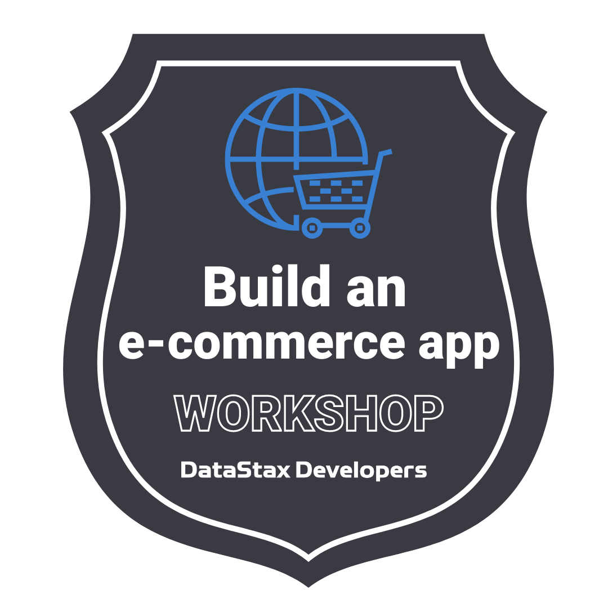

<!--- STARTEXCLUDE --->
## 🔥 Building an E-commerce Website 🔥

[](https://gitpod.io/#https://github.com/datastaxdevs/workshop-ecommerce-app)
[](http://www.apache.org/licenses/LICENSE-2.0)
[](https://discord.com/widget?id=685554030159593522&theme=dark)


## Materials for the Session

It doesn't matter if you join our workshop live or you prefer to do at your own pace, we have you covered. In this repository, you'll find everything you need for this workshop:

- [Slide deck](./slides.pdf)
- [Questions and Answers](https://community.datastax.com/)
- [Worskhop code] (https://github.com/datastaxdevs/workshop-ecommerce-app)

If you cannot attend this workshop live, recordings of this workshop and many more is available on [Youtube](https://youtube.com/datastaxdevs).

## Homework



Complete the homework to earn the badge for this workshop (awarded at the end of the series).

1. Rollup your sleeves, and modify the underlying product data.
    - Add your own product to the website.
        1. `INSERT` rows into the product, price, and category tables. Section [4a](https://github.com/datastaxdevs/workshop-ecommerce-app#-4a-execute-the-following-script-to-populate-the-tables-with-the-data-below) will provide some clues on to do that.
        2. Navigate to your product, and add it to your shopping cart.
        3. View the shopping cart.
2. Take a SCREENSHOT of the shopping cart containing your new product!
3. Don't worry about submitting it just yet.  We'll have instructions on how to do that at the end of the series!

## 📋 Table of contents

1. [Introduction](#1-introduction)
2. [Create your Database](#2-create-astra-db-instance)
3. [Create your schema](#3-create-your-schema)
4. [Populate the dataset](#4-populate-the-data)
5. [Create a token](#5-create-your-token)
6. [Setup your application](#6-setup-your-application)
7. [Run Unit Tests](#7-run-unit-tests)
8. [Start the Backend API](#8-start-the-backend-api)
9. [Start the Application](#9-start-the-frontend)

## 1. Introduction

Are you building or do you support an e-commerce website?  If so, then this content is for **you**!

Worldwide digital sales in 2020 eclipsed four trillion dollars (USD).  Businesses that want to compete, need a high performing e-commerce website.  Here, we will demonstrate how to build a high performing persistence layer with DataStax **`ASTRA DB`**.

Why does an e-commerce site need to be fast?  Because most consumers will leave a web page or a mobile app if it takes longer than a few seconds to load.  In the content below, we will cover how to build high-performing data models and services, helping you to build a e-commerce site with high throughput and low latency.

## 2. Create Astra DB Instance

You can skip to step 2c if you have already created a keyspace `ecommerce` in database `demos`. Otherwise (if you did not attend the previous installment of the e-commerce worksop):

**`ASTRA DB`** is the simplest way to run Cassandra with zero operations - just push the button and get your cluster. No credit card required, $25.00 USD credit every month, roughly 20M read/write operations, 80GB storage monthly - sufficient to run small production workloads.

#### ✅ 2a. Register

If you do not have an account yet, register and sign in to Astra DB: This is FREE and NO CREDIT CARD is required. [https://astra.datastax.com](https://astra.dev/1-31): You can use your `Github`, `Google` accounts or register with an `email`.

_Make sure to chose a password with minimum 8 characters, containing upper and lowercase letters, at least one number and special character_

#### ✅ 2b. Create a "FREE" plan

Follow this [guide](https://docs.datastax.com/en/astra/docs/creating-your-astra-database.html), to set up a pay as you go database with a free $25 monthly credit. You will find below recommended values to enter:

- **For the database name** - `demos`

- **For the keyspace name** - `ecommerce`

_You can technically use whatever name(s) you want and update the code to reflect the keyspace. This is really to get you on a happy path for the first run._

- **For provider and region**: Choose a provider (GCP, Azure or AWS) and then the related region is where your database will reside physically (choose one close to you or your users).

- **Create the database**. Review all the fields to make sure they are as shown, and click the `Create Database` button.

**👁️ Walkthrough**

*The Walkthrough mentions a different keyspace, make sure to use `ecommerce`*


You will see your new database `pending` in the Dashboard.


#### ✅ 2c. Ensure the database turns to active state

To connect to the database programmatically, you need to make sure the status will change to `Active`. This happens when the database is ready, and will only take 2-3 minutes. You will also receive an email when it is ready.


**👁️ Expected Output**


If it's in a `standby` state you can hit `Connect` and `CQL Console` on top.

You should see a message something like below.

**👁️ Expected Output**

```cql
{"message":"Resuming your database, please try again shortly."}
```

[🏠 Back to Table of Contents](#-table-of-contents)

## 3. Create your schema

**Introduction**
This section will provide DDL to create three tables inside the "ecommerce" keyspace: category, price, and product.

### Session 1 - Product data model ###
The `product` table supports all product data queries, and uses `product_id` as a single key.  It has a few columns for specific product data, but any ad-hoc or non-standard properties can be added to the `specifications` map.

The `category` table will support all product navigation service calls.  It is designed to provide recursive, hierarchical navigation without a pre-set limit on the number of levels.  The top-most level only exists as a `parent_id`, and the bottom-most level contains products.

The `price` table was intentionally split-off from product.  There are several reasons for this.  Price data is much more likely to change than pure product data (different read/write patterns).  Also, large enterprises typically have separate teams for product and price, meaning they will usually have different micro-service layers and data stores.

The `featured_product_groups` table was a late-add, to be able to provide some extra "atmosphere" of an e-commerce website.  This way, the UI has a means by which to highlight a few, select products.

### Session 2 - Shopping Cart data model ###

The `user_carts` table supports

The `cart_products` table

#### ✅ 3a. Open the CqlConsole on Astra

```sql
use ecommerce;
```

#### ✅ 3b. Execute the following CQL script to create the schema

#### Session 1 - Product data model ####
```sql
/* category table */
CREATE TABLE IF NOT EXISTS category (
    parent_id UUID,
    category_id UUID,
    name TEXT,
    image TEXT,
    products LIST<TEXT>,
PRIMARY KEY (parent_id,category_id));

/* price table */
CREATE TABLE IF NOT EXISTS price (
    product_id TEXT,
    store_id TEXT,
    value DECIMAL,
PRIMARY KEY(product_id,store_id));

/* product table */
CREATE TABLE IF NOT EXISTS product (
    product_id TEXT,
    product_group TEXT,
    name TEXT,
    brand TEXT,
    model_number TEXT,
    short_desc TEXT,
    long_desc TEXT,
    specifications MAP<TEXT,TEXT>,
    linked_documents MAP<TEXT,TEXT>,
    images SET<TEXT>,
PRIMARY KEY(product_id));

/* featured product groups table */
CREATE TABLE IF NOT EXISTS featured_product_groups (
    feature_id INT,
    category_id UUID,
    name TEXT,
    image TEXT,
    parent_id UUID,
    price DECIMAL,
PRIMARY KEY (feature_id,category_id));
```

#### Session 2 - Shopping Cart data model ####
```sql
CREATE TABLE IF NOT EXISTS user_carts (
    user_id uuid,
    cart_name text,
    cart_id uuid,
    cart_is_active boolean,
    user_email text static,
    PRIMARY KEY (user_id, cart_name, cart_id)
) WITH default_time_to_live = 5184000;

CREATE TABLE IF NOT EXISTS cart_products (
    cart_id uuid,
    product_timestamp timestamp,
    product_id text,
    product_description text,
    product_name text,
    quantity int,
    PRIMARY KEY (cart_id, product_timestamp, product_id)
) WITH CLUSTERING ORDER BY (product_timestamp DESC, product_id ASC)
  AND default_time_to_live = 5184000;
```

[🏠 Back to Table of Contents](#-table-of-contents)

## 4. Populate the Data

#### ✅ 4a. Execute the following script to populate the tables with the data below

#### Session 1 - Product data ####

```sql
INSERT INTO category (name,category_id,image,parent_id) VALUES ('Clothing',18105592-77aa-4469-8556-833b419dacf4,'ls534.png',ffdac25a-0244-4894-bb31-a0884bc82aa9);
INSERT INTO category (name,category_id,image,parent_id) VALUES ('Tech Accessories',5929e846-53e8-473e-8525-80b666c46a83,'',ffdac25a-0244-4894-bb31-a0884bc82aa9);
INSERT INTO category (name,category_id,image,parent_id) VALUES ('Cups and Mugs',675cf3a2-2752-4de7-ae2e-849471c29f51,'',ffdac25a-0244-4894-bb31-a0884bc82aa9);
INSERT INTO category (name,category_id,image,parent_id) VALUES ('Wall Decor',591bf485-de09-4b46-8fd2-5d9dc7ca101e,'bh001.png',ffdac25a-0244-4894-bb31-a0884bc82aa9);
INSERT INTO category (name,category_id,image,parent_id) VALUES ('T-Shirts',91455473-212e-4c6e-8bec-1da06779ae10,'ls534.png',18105592-77aa-4469-8556-833b419dacf4);
INSERT INTO category (name,category_id,image,parent_id) VALUES ('Hoodies',6a4d86aa-ceb5-4c6f-b9b9-80e9a8c58ad1,'',18105592-77aa-4469-8556-833b419dacf4);
INSERT INTO category (name,category_id,image,parent_id) VALUES ('Jackets',d887b049-d16c-46e1-8c94-0a1280dedc30,'',18105592-77aa-4469-8556-833b419dacf4);
INSERT INTO category (name,category_id,image,parent_id) VALUES ('Mousepads',d04dfb5b-69c6-4e97-b572-e9e390165a84,'',5929e846-53e8-473e-8525-80b666c46a83);
INSERT INTO category (name,category_id,image,parent_id) VALUES ('Wrist Rests',aa161129-d456-45ba-b1f0-fac7898b6d06,'',5929e846-53e8-473e-8525-80b666c46a83);
INSERT INTO category (name,category_id,image,parent_id) VALUES ('Laptop Covers',1c4b8599-78df-4f93-9c52-578bd959a3a5,'',5929e846-53e8-473e-8525-80b666c46a83);
INSERT INTO category (name,category_id,image,parent_id) VALUES ('Cups',7536fdef-fcd9-44a3-9360-0bffd2904408,'',675cf3a2-2752-4de7-ae2e-849471c29f51);
INSERT INTO category (name,category_id,image,parent_id) VALUES ('Coffee Mugs',20374300-185c-4ee5-b0bc-77fbdc3a21ed,'',675cf3a2-2752-4de7-ae2e-849471c29f51);
INSERT INTO category (name,category_id,image,parent_id) VALUES ('Travel Mugs',0660483e-2fad-447b-b19a-63ab4935e482,'',675cf3a2-2752-4de7-ae2e-849471c29f51);
INSERT INTO category (name,category_id,image,parent_id) VALUES ('Posters',fdbe9dcb-6878-4216-a64d-27c094b1b075,'',591bf485-de09-4b46-8fd2-5d9dc7ca101e);
INSERT INTO category (name,category_id,image,parent_id) VALUES ('Wall Art',943482f9-070c-4390-bb30-2107b6fe653a,'bh001.png',591bf485-de09-4b46-8fd2-5d9dc7ca101e);
INSERT INTO category (name,category_id,image,parent_id,products) VALUES ('Men''s "Go Away...Annotation" T-Shirt',99c4d825-d262-4a95-a04e-cc72e7e273c1,'ls534.png',91455473-212e-4c6e-8bec-1da06779ae10,['LS534S','LS534M','LS534L','LS534XL','LS5342XL','LS5343XL']);
INSERT INTO category (name,category_id,image,parent_id,products) VALUES ('Men''s "Your Face...Autowired" T-Shirt',3fa13eee-d057-48d0-b0ae-2d83af9e3e3e,'ls355.png',91455473-212e-4c6e-8bec-1da06779ae10,['LS355S','LS355M','LS355L','LS355XL','LS3552XL','LS3553XL']);
INSERT INTO category (name,category_id,image,parent_id,products) VALUES ('Bigheads',2f25a732-0744-406d-baee-3e8131cbe500,'bh001.png',943482f9-070c-4390-bb30-2107b6fe653a,['bh001','bh002','bh003']);
INSERT INTO category (name,category_id,image,parent_id,products) VALUES ('DataStax Gray Track Jacket',f629e107-b219-4563-a852-6909fd246949,'dss821.jpg',d887b049-d16c-46e1-8c94-0a1280dedc30,['DSS821S','DSS821M','DSS821L','DSS821XL']);
INSERT INTO category (name,category_id,image,parent_id,products) VALUES ('DataStax Vintage 2015 MVP Hoodie',86d234a4-6b97-476c-ada8-efb344d39743,'dsh915.jpg',6a4d86aa-ceb5-4c6f-b9b9-80e9a8c58ad1,['DSH915S','DSH915M','DSH915L','DSH915XL']);
INSERT INTO category (name,category_id,image,parent_id,products) VALUES ('DataStax Black Hoodie',b9bed3c0-0a76-44ea-bce6-f5f21611a3f1,'dsh916.jpg',6a4d86aa-ceb5-4c6f-b9b9-80e9a8c58ad1,['DSH916S','DSH916M','DSH916L','DSH916XL']);
INSERT INTO category (name,category_id,image,parent_id,products) VALUES ('Apache Cassandra 3.0 Contributor T-Shirt',95ae4613-0184-46ee-b4b0-adfe882754a8,'apc30a.jpg',91455473-212e-4c6e-8bec-1da06779ae10,['APC30S','APC30M','APC30L','APC30XL','APC302XL','APC303XL']);
INSERT INTO category (name,category_id,image,parent_id,products) VALUES ('DataStax Astra "One Team" Long Sleeve Tee',775be203-1a84-4822-9645-4da98ca2b2d8,'dsa1121.jpg',91455473-212e-4c6e-8bec-1da06779ae10,['DSA1121S','DSA1121M','DSA1121L','DSA1121XL','DSA11212XL','DSA11213XL']);

INSERT INTO price(product_id,store_id,value) VALUES ('LS534S','web',14.99);
INSERT INTO price(product_id,store_id,value) VALUES ('LS534M','web',14.99);
INSERT INTO price(product_id,store_id,value) VALUES ('LS534L','web',14.99);
INSERT INTO price(product_id,store_id,value) VALUES ('LS534XL','web',14.99);
INSERT INTO price(product_id,store_id,value) VALUES ('LS5342XL','web',16.99);
INSERT INTO price(product_id,store_id,value) VALUES ('LS5343XL','web',16.99);
INSERT INTO price(product_id,store_id,value) VALUES ('LN355S','web',14.99);
INSERT INTO price(product_id,store_id,value) VALUES ('LN355M','web',14.99);
INSERT INTO price(product_id,store_id,value) VALUES ('LN355L','web',14.99);
INSERT INTO price(product_id,store_id,value) VALUES ('LN355XL','web',14.99);
INSERT INTO price(product_id,store_id,value) VALUES ('LN3552XL','web',16.99);
INSERT INTO price(product_id,store_id,value) VALUES ('LN3553XL','web',16.99);
INSERT INTO price(product_id,store_id,value) VALUES ('DSA1121S','web',21.99);
INSERT INTO price(product_id,store_id,value) VALUES ('DSA1121M','web',21.99);
INSERT INTO price(product_id,store_id,value) VALUES ('DSA1121L','web',21.99);
INSERT INTO price(product_id,store_id,value) VALUES ('DSA1121XL','web',21.99);
INSERT INTO price(product_id,store_id,value) VALUES ('DSA11212XL','web',23.99);
INSERT INTO price(product_id,store_id,value) VALUES ('DSA11213XL','web',23.99);
INSERT INTO price(product_id,store_id,value) VALUES ('DSS821S','web',44.99);
INSERT INTO price(product_id,store_id,value) VALUES ('DSS821M','web',44.99);
INSERT INTO price(product_id,store_id,value) VALUES ('DSS821L','web',44.99);
INSERT INTO price(product_id,store_id,value) VALUES ('DSS821XL','web',44.99);
INSERT INTO price(product_id,store_id,value) VALUES ('DSH915S','web',35.99);
INSERT INTO price(product_id,store_id,value) VALUES ('DSH915M','web',35.99);
INSERT INTO price(product_id,store_id,value) VALUES ('DSH915L','web',35.99);
INSERT INTO price(product_id,store_id,value) VALUES ('DSH915XL','web',35.99);
INSERT INTO price(product_id,store_id,value) VALUES ('DSH916S','web',35.99);
INSERT INTO price(product_id,store_id,value) VALUES ('DSH916M','web',35.99);
INSERT INTO price(product_id,store_id,value) VALUES ('DSH916L','web',35.99);
INSERT INTO price(product_id,store_id,value) VALUES ('DSH916XL','web',35.99);
INSERT INTO price(product_id,store_id,value) VALUES ('APC30S','web',15.99);
INSERT INTO price(product_id,store_id,value) VALUES ('APC30M','web',15.99);
INSERT INTO price(product_id,store_id,value) VALUES ('APC30L','web',15.99);
INSERT INTO price(product_id,store_id,value) VALUES ('APC30XL','web',15.99);
INSERT INTO price(product_id,store_id,value) VALUES ('APC302XL','web',17.99);
INSERT INTO price(product_id,store_id,value) VALUES ('APC303XL','web',17.99);

INSERT INTO product(product_id,product_group,name,brand,model_number,short_desc,long_desc,specifications,images)
VALUES ('LS534S','LS534','Go Away Annotation T-Shirt','NerdShirts','NS101','Men''s Small "Go Away...Annotation" T-Shirt','Having to answer support questions when you really want to get back to coding?  Wear this to work, and let there be no question as to what you''d rather be doing.',{'size':'Small','material':'cotton, polyester','cut':'men''s','color':'black'},{'ls534.png'});
INSERT INTO product(product_id,product_group,name,brand,model_number,short_desc,long_desc,specifications,images)
VALUES ('LS534M','LS534','Go Away Annotation T-Shirt','NerdShirts','NS101','Men''s Medium "Go Away...Annotation" T-Shirt','Having to answer support questions when you really want to get back to coding?  Wear this to work, and let there be no question as to what you''d rather be doing.',{'size':'Medium','material':'cotton, polyester','cut':'men''s','color':'black'},{'ls534.png'});
INSERT INTO product(product_id,product_group,name,brand,model_number,short_desc,long_desc,specifications,images)
VALUES ('LS534L','LS534','Go Away Annotation T-Shirt','NerdShirts','NS101','Men''s Large "Go Away...Annotation" T-Shirt','Having to answer support questions when you really want to get back to coding?  Wear this to work, and let there be no question as to what you''d rather be doing.',{'size':'Large','material':'cotton, polyester','cut':'men''s','color':'black'},{'ls534.png'});
INSERT INTO product(product_id,product_group,name,brand,model_number,short_desc,long_desc,specifications,images)
VALUES ('LS534XL','LS534','Go Away Annotation T-Shirt','NerdShirts','NS101','Men''s Extra Large "Go Away...Annotation" T-Shirt','Having to answer support questions when you really want to get back to coding?  Wear this to work, and let there be no question as to what you''d rather be doing.',{'size':'Extra Large','material':'cotton, polyester','cut':'men''s','color':'black'},{'ls534.png'});
INSERT INTO product(product_id,product_group,name,brand,model_number,short_desc,long_desc,specifications,images)
VALUES ('LS5342XL','LS534','Go Away Annotation T-Shirt','NerdShirts','NS101','Men''s 2x Large "Go Away...Annotation" T-Shirt','Having to answer support questions when you really want to get back to coding?  Wear this to work, and let there be no question as to what you''d rather be doing.',{'size':'2x Large','material':'cotton, polyester','cut':'men''s','color':'black'},{'ls534.png'});
INSERT INTO product(product_id,product_group,name,brand,model_number,short_desc,long_desc,specifications,images)
VALUES ('LS5343XL','LS534','Go Away Annotation T-Shirt','NerdShirts','NS101','Men''s 3x Large "Go Away...Annotation" T-Shirt','Having to answer support questions when you really want to get back to coding?  Wear this to work, and let there be no question as to what you''d rather be doing.',{'size':'3x Large','material':'cotton, polyester','cut':'men''s','color':'black'},{'ls534.png'});
INSERT INTO product(product_id,product_group,name,brand,model_number,short_desc,long_desc,specifications,images)
VALUES ('LN355S','LN355','Your Face is an @Autowired @Bean T-Shirt','NerdShirts','NS102','Men''s Small "Your Face...Autowired" T-Shirt','Everyone knows that one person who overuses the "your face" jokes.',{'size':'Small','material':'cotton, polyester','cut':'men''s','color':'black'},{'ln355.png'});
INSERT INTO product(product_id,product_group,name,brand,model_number,short_desc,long_desc,specifications,images)
VALUES ('LN355M','LN355','Your Face is an @Autowired @Bean T-Shirt','NerdShirts','NS102','Men''s Medium "Your Face...Autowired" T-Shirt','Everyone knows that one person who overuses the "your face" jokes.',{'size':'Medium','material':'cotton, polyester','cut':'men''s','color':'black'},{'ln355.png'});
INSERT INTO product(product_id,product_group,name,brand,model_number,short_desc,long_desc,specifications,images)
VALUES ('LN355L','LN355','Your Face is an @Autowired @Bean T-Shirt','NerdShirts','NS102','Men''s Large "Your Face...Autowired" T-Shirt','Everyone knows that one person who overuses the "your face" jokes.',{'size':'Large','material':'cotton, polyester','cut':'men''s','color':'black'},{'ln355.png'});
INSERT INTO product(product_id,product_group,name,brand,model_number,short_desc,long_desc,specifications,images)
VALUES ('LN355XL','LN355','Your Face is an @Autowired @Bean T-Shirt','NerdShirts','NS102','Men''s Extra Large "Your Face...Autowired" T-Shirt','Everyone knows that one person who overuses the "your face" jokes.',{'size':'Extra Large','material':'cotton, polyester','cut':'men''s','color':'black'},{'ln355.png'});
INSERT INTO product(product_id,product_group,name,brand,model_number,short_desc,long_desc,specifications,images)
VALUES ('LN3552XL','LN355','Your Face is an @Autowired @Bean T-Shirt','NerdShirts','NS102','Men''s 2x Large "Your Face...Autowired" T-Shirt','Everyone knows that one person who overuses the "your face" jokes.',{'size':'2x Large','material':'cotton, polyester','cut':'men''s','color':'black'},{'ln355.png'});
INSERT INTO product(product_id,product_group,name,brand,model_number,short_desc,long_desc,specifications,images)
VALUES ('LN355XL','LN355','Your Face is an @Autowired @Bean T-Shirt','NerdShirts','NS102','Men''s 3x Large "Your Face...Autowired" T-Shirt','Everyone knows that one person who overuses the "your face" jokes.',{'size':'3x Large','material':'cotton, polyester','cut':'men''s','color':'black'},{'ln355.png'});
INSERT INTO product(product_id,product_group,name,brand,model_number,short_desc,long_desc,specifications,images)
VALUES ('DSA1121S','DSA1121','DataStax Astra "One Team" Long Sleeve Tee','DataStax','DSA1121','DataStax Astra "One Team" Long Sleeve Tee - Small','Given out at the internal summit, show how proud you are to talk about the world''s best multi-region, multi-cloud, serverless database!',{'size':'Small','material':'cotton, polyester','color':'black'},{'apc30.jpg'});
INSERT INTO product(product_id,product_group,name,brand,model_number,short_desc,long_desc,specifications,images)
VALUES ('DSA1121M','DSA1121','DataStax Astra "One Team" Long Sleeve Tee','DataStax','DSA1121','DataStax Astra "One Team" Long Sleeve Tee - Medium','Given out at the internal summit, show how proud you are to talk about the world''s best multi-region, multi-cloud, serverless database!',{'size':'Medium','material':'cotton, polyester','color':'black'},{'apc30.jpg'});
INSERT INTO product(product_id,product_group,name,brand,model_number,short_desc,long_desc,specifications,images)
VALUES ('DSA1121L','DSA1121','DataStax Astra "One Team" Long Sleeve Tee','DataStax','DSA1121','DataStax Astra "One Team" Long Sleeve Tee - Large','Given out at the internal summit, show how proud you are to talk about the world''s best multi-region, multi-cloud, serverless database!',{'size':'Large','material':'cotton, polyester','color':'black'},{'apc30.jpg'});
INSERT INTO product(product_id,product_group,name,brand,model_number,short_desc,long_desc,specifications,images)
VALUES ('DSA1121XL','DSA1121','DataStax Astra "One Team" Long Sleeve Tee','DataStax','DSA1121','DataStax Astra "One Team" Long Sleeve Tee - Extra Large','Given out at the internal summit, show how proud you are to talk about the world''s best multi-region, multi-cloud, serverless database!',{'size':'Extra Large','material':'cotton, polyester','color':'black'},{'apc30.jpg'});
INSERT INTO product(product_id,product_group,name,brand,model_number,short_desc,long_desc,specifications,images)
VALUES ('DSA11212XL','DSA1121','DataStax Astra "One Team" Long Sleeve Tee','DataStax','DSA1121','DataStax Astra "One Team" Long Sleeve Tee - 2X Large','Given out at the internal summit, show how proud you are to talk about the world''s best multi-region, multi-cloud, serverless database!',{'size':'2X Large','material':'cotton, polyester','color':'black'},{'apc30.jpg'});
INSERT INTO product(product_id,product_group,name,brand,model_number,short_desc,long_desc,specifications,images)
VALUES ('DSA11213XL','DSA1121','DataStax Astra "One Team" Long Sleeve Tee','DataStax','DSA1121','DataStax Astra "One Team" Long Sleeve Tee - 3X Large','Given out at the internal summit, show how proud you are to talk about the world''s best multi-region, multi-cloud, serverless database!',{'size':'3X Large','material':'cotton, polyester','color':'black'},{'apc30.jpg'});
INSERT INTO product(product_id,product_group,name,brand,model_number,short_desc,long_desc,specifications,images)
VALUES ('APC30S','APC30','Apache Cassandra 3.0 Contributor T-Shirt','Apache Foundation','APC30','Apache Cassandra 3.0 Contributor T-Shirt - Small','Own a piece of Cassandra history with this Apache Cassandra 3.0 "Contributor" shirt.  Given out to all of the contributors to the project in 2016, shows the unmistakable Cassandra Eye on the front, with the
engine rebuild" on the back.',{'size':'Small','material':'cotton, polyester','color':'black'},{'apc30.jpg'});
INSERT INTO product(product_id,product_group,name,brand,model_number,short_desc,long_desc,specifications,images)
VALUES ('APC30M','APC30','Apache Cassandra 3.0 Contributor T-Shirt','Apache Foundation','APC30','Apache Cassandra 3.0 Contributor T-Shirt - Medium','Own a piece of Cassandra history with this Apache Cassandra 3.0 "Contributor" shirt.  Given out to all of the contributors to the project in 2016, shows the unmistakable Cassandra Eye on the front, with the
engine rebuild" on the back.',{'size':'Medium','material':'cotton, polyester','color':'black'},{'apc30.jpg'});
INSERT INTO product(product_id,product_group,name,brand,model_number,short_desc,long_desc,specifications,images)
VALUES ('APC30L','APC30','Apache Cassandra 3.0 Contributor T-Shirt','Apache Foundation','APC30','Apache Cassandra 3.0 Contributor T-Shirt - Large','Own a piece of Cassandra history with this Apache Cassandra 3.0 "Contributor" shirt.  Given out to all of the contributors to the project in 2016, shows the unmistakable Cassandra Eye on the front, with the
engine rebuild" on the back.',{'size':'Large','material':'cotton, polyester','color':'black'},{'apc30.jpg'});
INSERT INTO product(product_id,product_group,name,brand,model_number,short_desc,long_desc,specifications,images)
VALUES ('APC30XL','APC30','Apache Cassandra 3.0 Contributor T-Shirt','Apache Foundation','APC30','Apache Cassandra 3.0 Contributor T-Shirt - Extra Large','Own a piece of Cassandra history with this Apache Cassandra 3.0 "Contributor" shirt.  Given out to all of the contributors to the project in 2016, shows the unmistakable Cassandra Eye on the front, with the
engine rebuild" on the back.',{'size':'Extra Large','material':'cotton, polyester','color':'black'},{'apc30.jpg'});
INSERT INTO product(product_id,product_group,name,brand,model_number,short_desc,long_desc,specifications,images)
VALUES ('APC302XL','APC30','Apache Cassandra 3.0 Contributor T-Shirt','Apache Foundation','APC30','Apache Cassandra 3.0 Contributor T-Shirt - 2X Large','Own a piece of Cassandra history with this Apache Cassandra 3.0 "Contributor" shirt.  Given out to all of the contributors to the project in 2016, shows the unmistakable Cassandra Eye on the front, with the
engine rebuild" on the back.',{'size':'2X Large','material':'cotton, polyester','color':'black'},{'apc30.jpg'});
INSERT INTO product(product_id,product_group,name,brand,model_number,short_desc,long_desc,specifications,images)
VALUES ('APC303XL','APC30','Apache Cassandra 3.0 Contributor T-Shirt','Apache Foundation','APC30','Apache Cassandra 3.0 Contributor T-Shirt - 3X Large','Own a piece of Cassandra history with this Apache Cassandra 3.0 "Contributor" shirt.  Given out to all of the contributors to the project in 2016, shows the unmistakable Cassandra Eye on the front, with the
engine rebuild" on the back.',{'size':'3X Large','material':'cotton, polyester','color':'black'},{'apc30.jpg'});
INSERT INTO product(product_id,product_group,name,brand,model_number,short_desc,long_desc,specifications,images)
VALUES ('DSS821S','DSS821','DataStax Gray Track Jacket','DataStax','DSS821','DataStax Gray Track Jacket - Small','This lightweight polyester jacket will be your favorite while hiking the trails or teeing off.',{'size':'Small','material':'polyester','color':'gray'},{'dss821.jpg'});
INSERT INTO product(product_id,product_group,name,brand,model_number,short_desc,long_desc,specifications,images)
VALUES ('DSS821M','DSS821','DataStax Gray Track Jacket','DataStax','DSS821','DataStax Gray Track Jacket - Medium','This lightweight polyester jacket will be your favorite while hiking the trails or teeing off.',{'size':'Medium','material':'polyester','color':'gray'},{'dss821.jpg'});
INSERT INTO product(product_id,product_group,name,brand,model_number,short_desc,long_desc,specifications,images)
VALUES ('DSS821L','DSS821','DataStax Gray Track Jacket','DataStax','DSS821','DataStax Gray Track Jacket - Large','This lightweight polyester jacket will be your favorite while hiking the trails or teeing off.',{'size':'Large','material':'polyester','color':'gray'},{'dss821.jpg'});
INSERT INTO product(product_id,product_group,name,brand,model_number,short_desc,long_desc,specifications,images)
VALUES ('DSS821XL','DSS821','DataStax Gray Track Jacket','DataStax','DSS821','DataStax Gray Track Jacket - Extra Large','This lightweight polyester jacket will be your favorite while hiking the trails or teeing off.',{'size':'Extra Large','material':'polyester','color':'gray'},{'dss821.jpg'});
INSERT INTO product(product_id,product_group,name,brand,model_number,short_desc,long_desc,specifications,images)
VALUES ('DSH915S','DSH915','DataStax Vintage 2015 MVP Hoodie','DataStax','DSS915','DataStax Vintage 2015 MVP Hoodie - Small','Given out to MVPs at the 2015 DataStax Cassandra Summit.  Warm!  You will underestimate how many times you will fall asleep wearing this!',{'size':'Small','color':'black'},{'dsh915.jpg'});
INSERT INTO product(product_id,product_group,name,brand,model_number,short_desc,long_desc,specifications,images)
VALUES ('DSH915M','DSH915','DataStax Vintage 2015 MVP Hoodie','DataStax','DSS915','DataStax Vintage 2015 MVP Hoodie - Medium','Given out to MVPs at the 2015 DataStax Cassandra Summit.  Warm!  You will underestimate how many times you will fall asleep wearing this!',{'size':'Medium','color':'black'},{'dsh915.jpg'});
INSERT INTO product(product_id,product_group,name,brand,model_number,short_desc,long_desc,specifications,images)
VALUES ('DSH915L','DSH915','DataStax Vintage 2015 MVP Hoodie','DataStax','DSS915','DataStax Vintage 2015 MVP Hoodie - Large','Given out to MVPs at the 2015 DataStax Cassandra Summit.  Warm!  You will underestimate how many times you will fall asleep wearing this!',{'size':'Large','color':'black'},{'dsh915.jpg'});
INSERT INTO product(product_id,product_group,name,brand,model_number,short_desc,long_desc,specifications,images)
VALUES ('DSH915XL','DSH915','DataStax Vintage 2015 MVP Hoodie','DataStax','DSS915','DataStax Vintage 2015 MVP Hoodie - Extra Large','Given out to MVPs at the 2015 DataStax Cassandra Summit.  Warm!  You will underestimate how many times you will fall asleep wearing this!',{'size':'Extra Large','color':'black'},{'dsh915.jpg'});
INSERT INTO product(product_id,product_group,name,brand,model_number,short_desc,long_desc,specifications,images)
VALUES ('DSH916S','DSH916','DataStax Vintage 2015 MVP Hoodie','DataStax','DSS916','DataStax Black Hoodie - Small','Super warm!  You will underestimate how many times you will fall asleep wearing this!',{'size':'Small','color':'black'},{'dsh916.jpg'});
INSERT INTO product(product_id,product_group,name,brand,model_number,short_desc,long_desc,specifications,images)
VALUES ('DSH916M','DSH916','DataStax Vintage 2015 MVP Hoodie','DataStax','DSS916','DataStax Black Hoodie - Medium','Super warm!  You will underestimate how many times you will fall asleep wearing this!',{'size':'Medium','color':'black'},{'dsh916.jpg'});
INSERT INTO product(product_id,product_group,name,brand,model_number,short_desc,long_desc,specifications,images)
VALUES ('DSH916L','DSH916','DataStax Vintage 2015 MVP Hoodie','DataStax','DSS916','DataStax Black Hoodie - Large','Super warm!  You will underestimate how many times you will fall asleep wearing this!',{'size':'Large','color':'black'},{'dsh916.jpg'});
INSERT INTO product(product_id,product_group,name,brand,model_number,short_desc,long_desc,specifications,images)
VALUES ('DSH916XL','DSH916','DataStax Black Hoodie','DataStax','DSS916','DataStax Black Hoodie - Extra Large','Super warm!  You will underestimate how many times you will fall asleep wearing this!',{'size':'Extra Large','color':'black'},{'dsh916.jpg'});

INSERT INTO featured_product_groups (feature_id,name,category_id,image,price,parent_id) VALUES (202112,'DataStax Gray Track Jacket',f629e107-b219-4563-a852-6909fd246949,'dss821.jpg',44.99,d887b049-d16c-46e1-8c94-0a1280dedc30);
INSERT INTO featured_product_groups (feature_id,name,category_id,image,price,parent_id) VALUES (202112,'DataStax Black Hoodie',b9bed3c0-0a76-44ea-bce6-f5f21611a3f1,'dsh916.jpg',35.99,6a4d86aa-ceb5-4c6f-b9b9-80e9a8c58ad1);
INSERT INTO featured_product_groups (feature_id,name,category_id,image,price,parent_id) VALUES (202112,'Apache Cassandra 3.0 Contributor T-Shirt',95ae4613-0184-46ee-b4b0-adfe882754a8,'apc30a.jpg',15.99,91455473-212e-4c6e-8bec-1da06779ae10);
INSERT INTO featured_product_groups (feature_id,name,category_id,image,price,parent_id) VALUES (202112,'DataStax Astra "One Team" Long Sleeve Tee',775be203-1a84-4822-9645-4da98ca2b2d8,'dsa1121.jpg',21.99,91455473-212e-4c6e-8bec-1da06779ae10);

```

Although it's not advised to use wildcards as below, you can verify the data has been created with the following command.

```
select * from CATEGORY;
```

**Notes:**

 - The "top" categories of the product hierarchy can be retrieved using a `parent_id` of "ffdac25a-0244-4894-bb31-a0884bc82aa9".
 - Without specifying a `category_id`, all categories for the `parent_id` are returned.
 - When a category from the "bottom" of the hierarchy is queried, a populated `products` ArrayList will be returned.  From there, the returned `product_id`s can be used with the `/product` service.
 - Category navigation is achieved by using the `parent_id` and `category_id` properties returned for each category (to build the "next level" category links).
 - `/category/ffdac25a-0244-4894-bb31-a0884bc82aa9`  =>  Category[Clothing, Cups and Mugs, Tech Accessories, Wall Decor]
 - `/category/ffdac25a-0244-4894-bb31-a0884bc82aa9/18105592-77aa-4469-8556-833b419dacf4`  =>  Category[Clothing]
 - `/category/18105592-77aa-4469-8556-833b419dacf4`  =>  Category[T-Shirts, Hoodies, Jackets]
 - `/category/91455473-212e-4c6e-8bec-1da06779ae10`  =>  Category[Men's "Your Face...Autowired" T-Shirt, Men's "Go Away...Annotation" T-Shirt]
 - The featured products table is a simple way for web marketers to promote small numbers of products, and have them appear in an organized fashion on the main page.  The `feature_id` key is simply an integer, with the default being `202112` (for December, 2021).  You can (of course) use other numeric naming schemes.

[🏠 Back to Table of Contents](#-table-of-contents)

## 5. Create your token

#### ✅ 5a. Create the token

Following the [Manage Application Tokens docs](https://docs.datastax.com/en/astra/docs/manage-application-tokens.html) create a token with `Database Admnistrator` roles.

- Go the `Organization Settings`

- Go to `Token Management`

- Pick the role `Database Administrator` on the select box

- Click Generate token

**👁️ Walkthrough**


This is what the token page looks like. You can now download the values as a CSV. We will need those values but you can also keep this window open for use later.


- `appToken:` We will use it as a api token Key to interact with APIs.

#### ✅ 5b. Save your token locally

To know more about roles of each token you can have a look to [this video.](https://www.youtube.com/watch?v=TUTCLsBuUd4&list=PL2g2h-wyI4SpWK1G3UaxXhzZc6aUFXbvL&index=8)

**Note: Make sure you don't close the window accidentally or otherwise - if you close this window before you copy the values, the application token is lost forever. They won't be available later for security reasons.**

We are now set with the database and credentials and will incorporate them into the application as we will see below.

[🏠 Back to Table of Contents](#-table-of-contents)

## 6. Setup your application

[](https://gitpod.io/#https://github.com/datastaxdevs/workshop-ecommerce-app)

### Know your Gitpod

Take a moment to read this entire section since it'll help you with the rest of the workshop as you'll be spending most of your time in Gitpod. If you're familiar with Gitpod, you can easily skip this entire section.

The extreme left side has the explorer view(1). The top left, middle to right is where you'll be editing files(2), etc. and the bottom left, middle to right is what we will refer to as the Gitpod terminal window(3) as shown below.

**👁️ Expected output**


You can always get back to the file explorer view whenever by clicking on the hamburger menu on the top left followed by `View` and `Explorer` as shown below.


You can allow cutting and pasting into the window by clicking on `Allow` as shown below.


✅ **6a: Enter the token**

To run the application you need to provide the credentials and identifier to the application. you will have to provide 4 values in total as shown below


Copy the environment sample file as below.

```
cp .env.example .env
```

Open the `.env` file as below.

```
gp open .env
```

- In Astra DB go back to home page by clicking the logo

- Select you database `demos` in the left panel and then copy values for `cloud-region` and `database-id` (clusterID) from the details page as shown below.

- *The DatabaseID is located on the home page*


- *The Database region (and keyspace) are located in the details page*


- Replace `application-token` with values shown on the Astra token screen or picking the values from the CSV token file your dowloaded before including the AstraCS: part of the token.


- *Make sure the Token looks something like (with AstraCS: preceeding `AstraCS:xxxxxxxxxxx:yyyyyyyyyyy`*

```yaml
# Copy this file to .env and fill in the appropriate values. Refer to README.md
# for instructions on where to find them.
export ASTRA_DB_ID=
export ASTRA_DB_REGION=
export ASTRA_DB_APPLICATION_TOKEN=
export ASTRA_DB_KEYSPACE=ecommerce
```

Make sure to inject the environment variables by running the following command

```
source .env
```

Verify that the environment variables are properly setup with the following command

```
env | grep -i astra
```

You should see four environment variables (not shown here).


[🏠 Back to Table of Contents](#-table-of-contents)

## 7. Run Unit Tests

The application is now set you should be able to interact with your DB. Let's demonstrate some capabilities.

✅ **7a: Use CqlSession**

Interaction with Cassandra are implemented in Java through drivers and the main Class is `CqlSession`.

Higher level frameworks like Spring, Spring Data, or even quarkus will rely on this object so let's make sure it is part of your Spring context with a `@SpringBootTest`.

Let's change to the sub-directory from the terminal window as shown below.

```
cd backend
```

Let's run the first test with the following command.


```bash
mvn test -Dtest=com.datastax.tutorials.Test01_Connectivity
```

**👁️ Expected output**

```bash
[..init...]
Execute some Cql (CqlSession)
+ Your Keyspace: sag_ecommerce
+ Product Categories:
Clothing
Cups and Mugs
Tech Accessories
Wall Decor
List Databases available in your Organization (AstraClient)
+ Your OrganizationID: e195fbea-79b6-4d60-9291-063d8c9e6364
+ Your Databases:
workshops	 : id=8c98b922-aeb0-4435-a0d5-a2788e23dff8, region=eu-central-1
sample_apps	 : id=c2d6bd3d-6112-47f6-9b66-b033e6174f0e, region=us-east-1
sdk_tests	 : id=a52f5879-3476-42d2-b5c9-81b18fc6d103, region=us-east-1
metrics	 : id=d7ded041-3cfb-4dd4-9957-e20003c3ebe2, region=us-east-1
```

✅ **7b: Working With Spring Data**

Spring Data allows Mapping `Object <=> Table` based on annotation at the java bean level. Then by convention CQL query will be executed under the hood.

```bash
mvn test -Dtest=com.datastax.tutorials.Test02_SpringData
```

**👁️ Expected output**

```bash
Categories:
- Clothing with children:[T-Shirts, Hoodies, Jackets]
- Cups and Mugs with children:[Cups, Coffee Mugs, Travel Mugs]
- Tech Accessories with children:[Mousepads, Wrist Rests, Laptop Covers]
- Wall Decor with children:[Posters, Wall Art]
```

✅ **7c: Working With Rest Controller**

`TestRestTemplate` is a neat way to test a web controller. The application will start on a random port with `@SpringBootTest(webEnvironment=WebEnvironment.RANDOM_PORT)`

```bash
mvn test -Dtest=com.datastax.tutorials.Test03_RestController
```

**👁️ Expected output**

```bash
List Categories:
Clothing
Cups and Mugs
Tech Accessories
Wall Decor
```

[🏠 Back to Table of Contents](#-table-of-contents)

## 8. Install the Backend

You can install the backend with the credentials using the following command

```
cd /workspace/workshop-ecommerce-app
mvn install -f backend/pom.xml -DskipTests
```

[🏠 Back to Table of Contents](#-table-of-contents)

## 9. Start the Application

✅ **9a: Know your public URL**

The workshop application has opened with an ephemeral URL. To know the URL where your application endpoint will be exposed you can run the following command in the terminal after the build has completed. **Please note this URL and we will open this up in a new browser window if required later **.

```bash
gp url 8080
```
**👁️ Expected output**


✅ **9b: Check APIs are not available (yet)**

Run the following command in the Gitpod terminal window

```
curl localhost:8080/api/v1/products/product/LS534S
```
**👁️ Expected output**

```
curl: (7) Failed to connect to localhost port 8080: Connection refused
```

Not to be overly concerned as we're going to be starting the application that will be served from the port.

✅ **9c: Start the application**

To start the application, we've provided a very simple convenience script that can be run as below.

```bash
./start.sh
```

Pay attention to popups being blocked as shown below and allow the popups.


You may encounter the following at different steps and although this may not be applicable right away, the steps are included **in advance** and summarized here so that you can keep an eye out for it. Different paths and different environments might be slightly different although Gitpod levels the playing field a bit.

Your e-commerce application should be up and running.

✅ **9d: Check APIs are now available**

Get back to Gitpod tab/window.

Leave the application running and open up another `shell` in the Gitpod terminal window by clicking on `+` and clicking on `bash` dropdown as shown below.


This will bring up a new `bash` shell as shown below.


Issue the following command in that shell as you did earlier.

```
curl localhost:8080/api/v1/products/product/LS534S
```

and you should see some output indicating that the API server is serving our ecommerce APIs.

**👁️ Expected output**


Try a few other APIs (**Hint: Look for the `RestController` java files in the respective sub-directories.**).

✅ **9e: OPTIONAL - Open in Gitpod preview window**

This might be useful for troubleshooting if your application does not automatically open up a browser tab.

If you want, you can run the following command to open your application in the preview window of Gitpod (it's much easier to use the app running in browser, though).

```
gp preview $(gp url 8080)
```

As indicated in the output below it's a very `Simple Browser`.

**👁️ Expected output**


If your application is running in the preview window but you have difficulty accessing it from the browser pay attention to popups being blocked by the browser as explained before.

✅ **9f: Get the Open API specification**

In the new shell window open the specification in the preview or browser with the following command

```
gp preview $(gp url 8080)/swagger-ui/index.html
```

The preview window looks like below. **It might help to close all the tabs or open this URL in a browser by clicking on the `open in browser` tab on the top right as shown**.

**👁️ Expected output**


Here's how it looks in the browser tab.


This is the docs for the open APIs that enables the frontend or any other program to obtain the data and manipulate it with REST-based CRUD operations.


[🏠 Back to Table of Contents](#-table-of-contents)

# Done?

Congratulations: you made to the end of today's workshop. You will notice that the application is still incomplete as we're evolving it. More building to follow!!!


**... and see you at our next workshop!**

> Sincerely yours, The DataStax Developers
